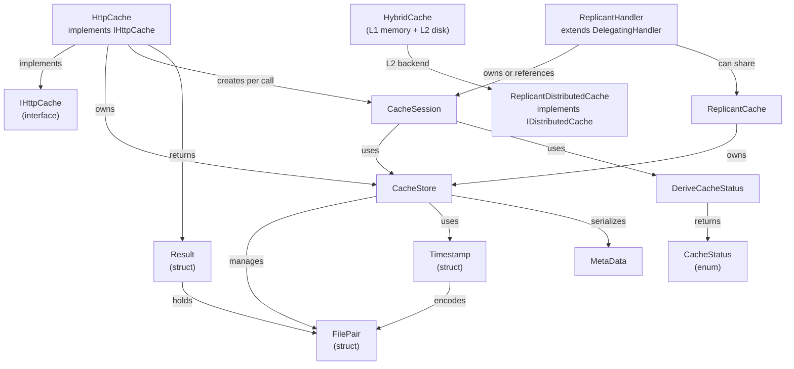
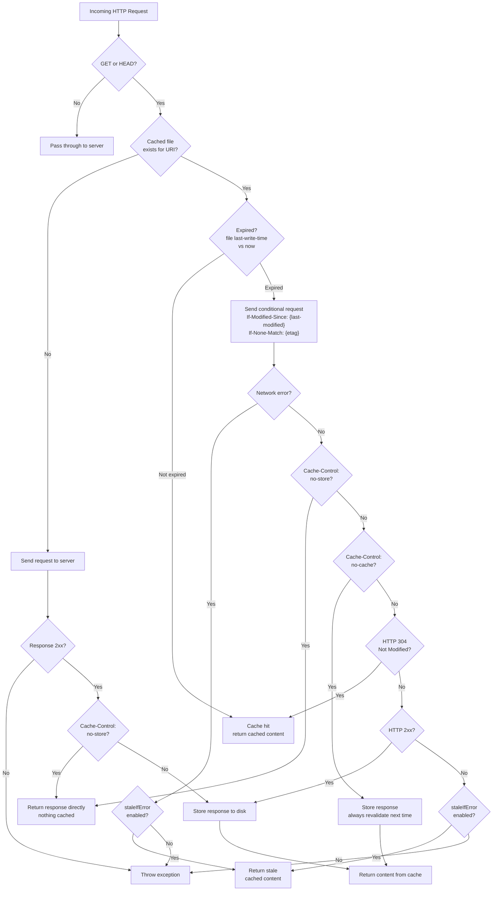

#  Replicant

[](https://ci.appveyor.com/project/SimonCropp/Replicant)
[](https://www.nuget.org/packages/Replicant/)

A wrapper for HttpClient that caches to disk. Cached files, over the max specified, are deleted based on the last access times.

**See [Milestones](../../milestones?state=closed) for release notes.**

Headers/Responses respected in caching decisions:

 * [Expires](https://developer.mozilla.org/en-US/docs/Web/HTTP/Headers/Expires)
 * [Cache-Control max-age](https://developer.mozilla.org/en-US/docs/Web/HTTP/Headers/Cache-Control#expiration)
 * [Cache-Control no-store](https://developer.mozilla.org/en-US/docs/Web/HTTP/Headers/Cache-Control#cacheability)
 * [Cache-Control no-cache](https://developer.mozilla.org/en-US/docs/Web/HTTP/Headers/Cache-Control#cacheability)
 * [Last-Modified](https://developer.mozilla.org/en-US/docs/Web/HTTP/Headers/Last-Modified)
 * [ETag](https://developer.mozilla.org/en-US/docs/Web/HTTP/Headers/ETag)


## NuGet package

https://nuget.org/packages/Replicant/


## Usage


### Default instance

There is a default static instance:

<!-- snippet: DefaultInstance -->
<a id='snippet-DefaultInstance'></a>
```cs
var content = await HttpCache.Default.DownloadAsync("https://httpbin.org/status/200");
```
<sup><a href='/src/Tests/HttpCacheTests.cs#L107-L111' title='Snippet source file'>snippet source</a> | <a href='#snippet-DefaultInstance' title='Start of snippet'>anchor</a></sup>
<!-- endSnippet -->

This caches to `{Temp}/Replicant`.


### Construction

An instance of HttpCache should be long running.

<!-- snippet: Construction -->
<a id='snippet-Construction'></a>
```cs
var httpCache = new HttpCache(
    cacheDirectory,
    // omit for default new HttpClient()
    new HttpClient
    {
        Timeout = TimeSpan.FromSeconds(30)
    },
    // omit for the default of 1000
    maxEntries: 10000);

// Dispose when finished
await httpCache.DisposeAsync();
```
<sup><a href='/src/Tests/HttpCacheTests.cs#L35-L50' title='Snippet source file'>snippet source</a> | <a href='#snippet-Construction' title='Start of snippet'>anchor</a></sup>
<!-- endSnippet -->


### Dependency injection

Add HttpCache as a singleton when using dependency injection.

<!-- snippet: DependencyInjection -->
<a id='snippet-DependencyInjection'></a>
```cs
var services = new ServiceCollection();
services.AddSingleton(_ => new HttpCache(diPath));

using var provider = services.BuildServiceProvider();
var httpCache = provider.GetRequiredService<HttpCache>();
NotNull(httpCache);
```
<sup><a href='/src/Tests/HttpCacheTests.cs#L58-L67' title='Snippet source file'>snippet source</a> | <a href='#snippet-DependencyInjection' title='Start of snippet'>anchor</a></sup>
<!-- endSnippet -->

Using HttpClient with [HttpClientFactory](https://docs.microsoft.com/en-us/dotnet/architecture/microservices/implement-resilient-applications/use-httpclientfactory-to-implement-resilient-http-requests).

<!-- snippet: DependencyInjectionWithHttpFactory -->
<a id='snippet-DependencyInjectionWithHttpFactory'></a>
```cs
var services = new ServiceCollection();
services.AddHttpClient();
services.AddSingleton(
    _ =>
    {
        var clientFactory = _.GetRequiredService<IHttpClientFactory>();
        return new HttpCache(diPath, clientFactory.CreateClient);
    });

using var provider = services.BuildServiceProvider();
var httpCache = provider.GetRequiredService<HttpCache>();
NotNull(httpCache);
```
<sup><a href='/src/Tests/HttpCacheTests.cs#L80-L95' title='Snippet source file'>snippet source</a> | <a href='#snippet-DependencyInjectionWithHttpFactory' title='Start of snippet'>anchor</a></sup>
<!-- endSnippet -->


### DelegatingHandler

ReplicantHandler can be used as a DelegatingHandler in the HttpClient pipeline:

<!-- snippet: ReplicantHandlerUsage -->
<a id='snippet-ReplicantHandlerUsage'></a>
```cs
var handler = new ReplicantHandler(cacheDirectory)
{
    InnerHandler = new HttpClientHandler()
};
using var client = new HttpClient(handler);
var response = await client.GetAsync("https://example.com");
```
<sup><a href='/src/Tests/CachingHandlerTests.cs#L26-L35' title='Snippet source file'>snippet source</a> | <a href='#snippet-ReplicantHandlerUsage' title='Start of snippet'>anchor</a></sup>
<!-- endSnippet -->


### DelegatingHandler with HttpClientFactory

ReplicantHandler integrates with [HttpClientFactory](https://docs.microsoft.com/en-us/dotnet/architecture/microservices/implement-resilient-applications/use-httpclientfactory-to-implement-resilient-http-requests) using `AddHttpMessageHandler`:

<!-- snippet: HttpClientFactoryUsage -->
<a id='snippet-HttpClientFactoryUsage'></a>
```cs
var services = new ServiceCollection();
services.AddHttpClient("CachedClient")
    .AddHttpMessageHandler(() => new ReplicantHandler(cacheDirectory));
```
<sup><a href='/src/Tests/CachingHandlerTests.cs#L40-L46' title='Snippet source file'>snippet source</a> | <a href='#snippet-HttpClientFactoryUsage' title='Start of snippet'>anchor</a></sup>
<!-- endSnippet -->

To share a single cache (and purge timer) across multiple named clients, register a `ReplicantCache` as a singleton:

<!-- snippet: HttpClientFactorySharedCacheUsage -->
<a id='snippet-HttpClientFactorySharedCacheUsage'></a>
```cs
var services = new ServiceCollection();
services.AddReplicantCache(cacheDirectory);
services.AddHttpClient("CachedClient")
    .AddReplicantCaching();
```
<sup><a href='/src/Tests/CachingHandlerTests.cs#L51-L58' title='Snippet source file'>snippet source</a> | <a href='#snippet-HttpClientFactorySharedCacheUsage' title='Start of snippet'>anchor</a></sup>
<!-- endSnippet -->


### HybridCache support

Replicant can serve as a disk-based L2 cache for [HybridCache](https://learn.microsoft.com/en-us/aspnet/core/performance/caching/hybrid). Register `ReplicantDistributedCache` as the `IDistributedCache` backend, and HybridCache will automatically use it for its L2 layer (with in-memory L1 handled by HybridCache itself):

<!-- snippet: DistributedCacheUsage -->
<a id='snippet-DistributedCacheUsage'></a>
```cs
var services = new ServiceCollection();
services.AddReplicantDistributedCache(cacheDirectory);
services.AddHybridCache();
```
<sup><a href='/src/Tests/DistributedCacheTests.cs#L25-L31' title='Snippet source file'>snippet source</a> | <a href='#snippet-DistributedCacheUsage' title='Start of snippet'>anchor</a></sup>
<!-- endSnippet -->


### Single cache per directory

Only one cache instance (`HttpCache`, `ReplicantCache`, or `ReplicantHandler` with its own directory) can exist per cache directory at any time. Creating a second instance for the same directory will throw an `InvalidOperationException`. This prevents multiple purge timers from running against the same files.

To share a cache across multiple handlers or consumers, use a single `ReplicantCache` instance (see above).


### Get a string

<!-- snippet: string -->
<a id='snippet-string'></a>
```cs
var content = await httpCache.StringAsync("https://httpbin.org/json");
```
<sup><a href='/src/Tests/HttpCacheTests.cs#L273-L277' title='Snippet source file'>snippet source</a> | <a href='#snippet-string' title='Start of snippet'>anchor</a></sup>
<a id='snippet-string-1'></a>
```cs
var lines = new List<string>();
await foreach (var line in httpCache.LinesAsync("https://httpbin.org/json"))
{
    lines.Add(line);
}
```
<sup><a href='/src/Tests/HttpCacheTests.cs#L285-L293' title='Snippet source file'>snippet source</a> | <a href='#snippet-string-1' title='Start of snippet'>anchor</a></sup>
<!-- endSnippet -->


### Get bytes

<!-- snippet: bytes -->
<a id='snippet-bytes'></a>
```cs
var bytes = await httpCache.BytesAsync("https://httpbin.org/json");
```
<sup><a href='/src/Tests/HttpCacheTests.cs#L301-L305' title='Snippet source file'>snippet source</a> | <a href='#snippet-bytes' title='Start of snippet'>anchor</a></sup>
<!-- endSnippet -->


### Get a stream

<!-- snippet: stream -->
<a id='snippet-stream'></a>
```cs
using var stream = await httpCache.StreamAsync("https://httpbin.org/json");
```
<sup><a href='/src/Tests/HttpCacheTests.cs#L313-L317' title='Snippet source file'>snippet source</a> | <a href='#snippet-stream' title='Start of snippet'>anchor</a></sup>
<!-- endSnippet -->


### Download to a file

<!-- snippet: ToFile -->
<a id='snippet-ToFile'></a>
```cs
await httpCache.ToFileAsync("https://httpbin.org/json", targetFile);
```
<sup><a href='/src/Tests/HttpCacheTests.cs#L328-L332' title='Snippet source file'>snippet source</a> | <a href='#snippet-ToFile' title='Start of snippet'>anchor</a></sup>
<!-- endSnippet -->


### Download to a stream

<!-- snippet: ToStream -->
<a id='snippet-ToStream'></a>
```cs
await httpCache.ToStreamAsync("https://httpbin.org/json", targetStream);
```
<sup><a href='/src/Tests/HttpCacheTests.cs#L347-L351' title='Snippet source file'>snippet source</a> | <a href='#snippet-ToStream' title='Start of snippet'>anchor</a></sup>
<!-- endSnippet -->


### Manually add an item to the cache

<!-- snippet: AddItem -->
<a id='snippet-AddItem'></a>
```cs
using var response = new HttpResponseMessage(HttpStatusCode.OK)
{
    Content = new StringContent("the content")
};
await httpCache.AddItemAsync(uri, response);
```
<sup><a href='/src/Tests/HttpCacheTests.cs#L410-L418' title='Snippet source file'>snippet source</a> | <a href='#snippet-AddItem' title='Start of snippet'>anchor</a></sup>
<!-- endSnippet -->


### Use stale item on error

If an error occurs when re-validating a potentially stale item, then the cached item can be used as a fallback.

<!-- snippet: staleIfError -->
<a id='snippet-staleIfError'></a>
```cs
var content = httpCache.StringAsync(uri, staleIfError: true);
```
<sup><a href='/src/Tests/HttpCacheTests.cs#L489-L493' title='Snippet source file'>snippet source</a> | <a href='#snippet-staleIfError' title='Start of snippet'>anchor</a></sup>
<!-- endSnippet -->


### Retry on transient failure

Transient HTTP failures and network exceptions are automatically retried with exponential backoff when `maxRetries` is set. This works with both `HttpCache` and `ReplicantHandler`.

Retried status codes:

 * `408` Request Timeout
 * `500` Internal Server Error
 * `502` Bad Gateway
 * `503` Service Unavailable
 * `504` Gateway Timeout

<!-- snippet: RetryHttpCacheUsage -->
<a id='snippet-RetryHttpCacheUsage'></a>
```cs
using var httpCache = new HttpCache(cacheDirectory, maxRetries: 3);
var content = await httpCache.StringAsync("https://example.com");
```
<sup><a href='/src/Tests/RetryTests.cs#L23-L28' title='Snippet source file'>snippet source</a> | <a href='#snippet-RetryHttpCacheUsage' title='Start of snippet'>anchor</a></sup>
<!-- endSnippet -->

<!-- snippet: RetryHandlerUsage -->
<a id='snippet-RetryHandlerUsage'></a>
```cs
var handler = new ReplicantHandler(cacheDirectory, maxRetries: 3)
{
    InnerHandler = new HttpClientHandler()
};
using var client = new HttpClient(handler);
var response = await client.GetAsync("https://example.com");
```
<sup><a href='/src/Tests/RetryTests.cs#L33-L42' title='Snippet source file'>snippet source</a> | <a href='#snippet-RetryHandlerUsage' title='Start of snippet'>anchor</a></sup>
<!-- endSnippet -->

Retries use exponential backoff (200ms, 400ms, 800ms, ...). When combined with `staleIfError`, retries are attempted first; if all retries are exhausted, stale cached content is returned as a fallback.


### Customizing HttpRequestMessage

The HttpRequestMessage used can be customized using a callback.

<!-- snippet: ModifyRequest -->
<a id='snippet-ModifyRequest'></a>
```cs
var content = await httpCache.StringAsync(
    uri,
    modifyRequest: message =>
    {
        message.Headers.Add("Key1", "Value1");
        message.Headers.Add("Key2", "Value2");
    });
```
<sup><a href='/src/Tests/HttpCacheTests.cs#L361-L371' title='Snippet source file'>snippet source</a> | <a href='#snippet-ModifyRequest' title='Start of snippet'>anchor</a></sup>
<!-- endSnippet -->


### Full HttpResponseMessage

An instance of the HttpResponseMessage can be created from a cached item:

<!-- snippet: FullHttpResponseMessage -->
<a id='snippet-FullHttpResponseMessage'></a>
```cs
using var response = await httpCache.ResponseAsync("https://httpbin.org/status/200");
```
<sup><a href='/src/Tests/HttpCacheTests.cs#L194-L198' title='Snippet source file'>snippet source</a> | <a href='#snippet-FullHttpResponseMessage' title='Start of snippet'>anchor</a></sup>
<!-- endSnippet -->


## Architecture



`HttpCache` is the standalone API that owns an `HttpClient`. `ReplicantHandler` is a `DelegatingHandler` that plugs into an existing `HttpClient` pipeline. Both delegate to `CacheSession` which orchestrates the cache protocol using `CacheStore` for disk I/O. When multiple handlers need to share a cache, a single `ReplicantCache` is registered as a singleton. `ReplicantDistributedCache` implements `IDistributedCache` for use as a disk-based L2 backend with `HybridCache`.


## Cache decision flow



### How expiry is determined

When storing a response, the cache expiry is derived from response headers in this order:

 1. `Expires` header — used as the absolute expiry time
 2. `Cache-Control: max-age` — expiry = now + max-age
 3. Neither present — no expiry, file last-write-time set to min date (always revalidate)

The expiry is persisted as the cached file's **last-write-time** in the filesystem.

### Conditional request headers

When a cached entry has expired, a conditional request is sent with:

 * `If-Modified-Since` — from the `Last-Modified` value stored in the cache filename
 * `If-None-Match` — from the `ETag` value stored in the cache filename (if present)

If the server responds `304 Not Modified`, the cached content is reused without re-downloading.


## Influences / Alternatives

 * [Tavis.HttpCache](https://github.com/tavis-software/Tavis.HttpCache)
 * [CacheCow](https://github.com/aliostad/CacheCow)
 * [Monkey Cache](https://github.com/jamesmontemagno/monkey-cache)


## Icon

[Cyborg](https://thenounproject.com/term/cyborg/689871/) designed by [Symbolon](https://thenounproject.com/symbolon/) from [The Noun Project](https://thenounproject.com).
